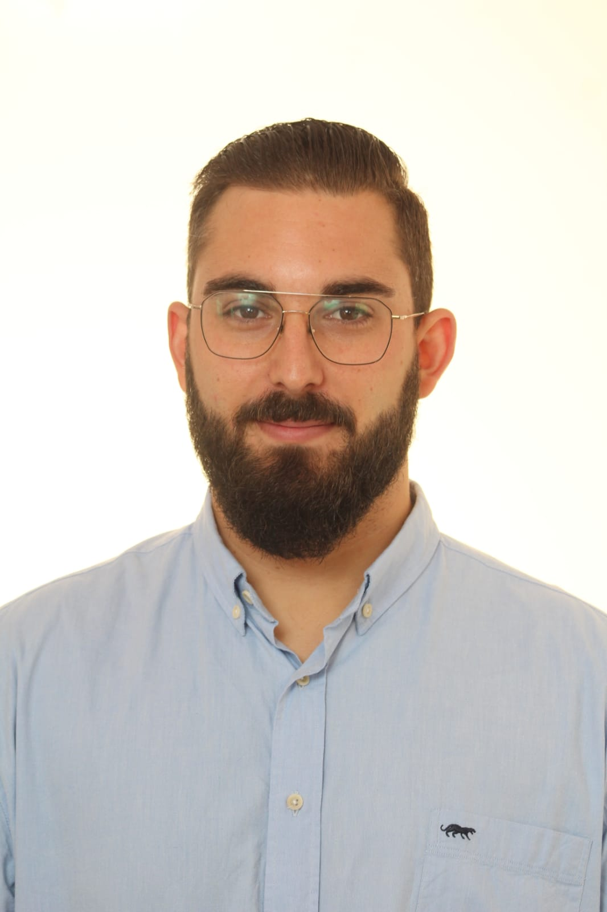
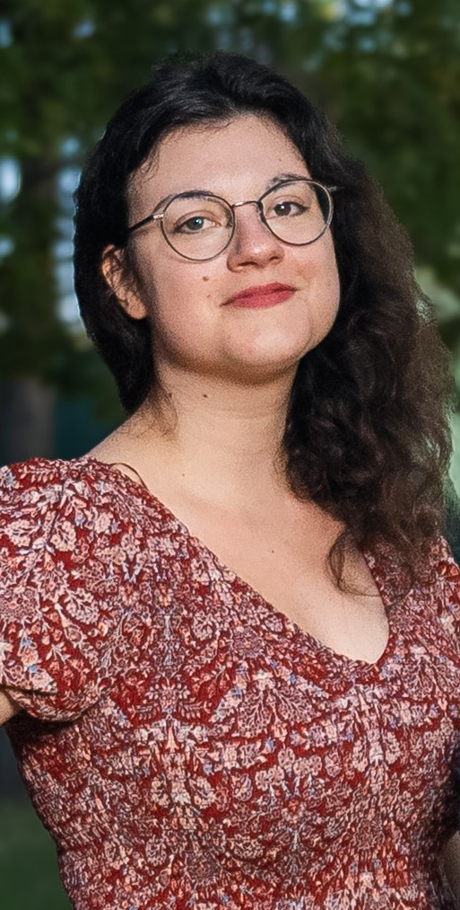



# THE Team

 

### Narciso M. Quijada 
`Principal Investigator`

Narciso is BSc in Pharmacy (Univ. Salamanca, USAL), MSc in Microbiology (Autonomous Univ. of Madrid) and PhD in Advances in Food Science and technology (2019, Univ. Burgos, UBU). After gaining his PhD he moved to Vienna (Austria) to perform 3 years of postdoc at Univ. Wien, Univ. Veterinary Medicine (VetMedUni) and FFoQSI Gmbh. Then, in 2022 he came back to Salamanca with a Marie Skłodowska-Curie Action that he developed at the Institute of Agribiotechnology Research (CIALE). At the end of 2024, he joined IBFG to lead the Bioinformatics and Data Sciences Unit. Since mid-2025 he is a CSIC senior scientist ("*científico titular*") and the group leader of `MicrobAR Lab`.

<ins>Find out more</ins>: [GitHub](https://github.com/nmquijada); [ORCID](https://orcid.org/0000-0002-1956-7205); [Scopus](https://www.scopus.com/authid/detail.uri?authorId=57192909558); [Google Scholar](https://scholar.google.es/citations?user=ElgNygIAAAAJ&hl=es&oi=ao)

 

 
 
# Current Lab members

 

### Raquel Barbero
`MSc Thesis`  

Raquel is doing her PhD at IRYCIS (Spain) and in parallel a MSc in Bioinformatics (Autonomous University of Madrid). She is doing her MSc Thesis in `MicrobAR Lab` studying the emergence of the global resistome of the human pathogen *Candidozyma auris*.

 

## Co-supervised PhD students

 

### Alejandro J. Alcañiz  

`PhD student`

Alejandro J. Alcañiz holds a degree in Biology from the University of Málaga and a Master’s in Biological Analysis and Laboratory Diagnostics from the University of Granada, Spain. After gaining experience as a clinical analyst in the private sector, he completed a postgraduate specialization in Bioinformatics and Computational Genomics at the University of Salamanca. He later joined the same university through the Investigo program, where he began his PhD in Agrobiotechnology at the CIALE research institute under the supervision of Dr. Enrique Monte. His doctoral research focuses on the development and application of bioinformatic tools to study beneficial microorganisms from a One Health perspective, integrating agricultural biotechnology, food technology, and the impact of maternal breastfeeding on the human microbiota. He is currently in the final stages of his PhD and works in Dr. María Carmen Collado’s research group on Lactic Acid Bacteria and Probiotics at the Institute of Agrochemistry and Food Technology (IATA-CSIC, Paterna, Valencia, Spain), within the European project INITIALISE (Inflammation in Human Early Life: Targeting Impacts on Life-Course Health).  

<ins>PhD supervisors</ins>: Enrique Monte (CIALE), Narciso M. Quijada (IBFG), Javier Sánchez-Martín (CIALE)

 

### David Mendoza-Salido
`PhD student`

David is doing his PhD in Agrobiotechnology at Univ. Salamanca and currently working at the Institute of Agribiotechnology Research (CIALE)  

<ins>PhD supervisors</ins>: Rosa Hermosa (CIALE), Narciso M. Quijada (IBFG)

 

### Moritz Hartmann

`PhD student`  

Moritz Hartmann completed his Bachelor’s degree in Food Science and Biotechnology and his Master’s degree in Food Science and Technology at the University of Natural Resources and Life Sciences (BOKU) in Vienna. His Master’s thesis focused on the effects of wine production and novel fining agents on the residual concentrations of specific fungicides in red wine grapes. After graduating, he became a founding member of the quality management team at Gurkerl.at. Currently, he is pursuing his PhD in the [Selberherr Lab](https://www.vetmeduni.ac.at/en/food-microbiology/about-us/team-evelyne-selberherr), where his research explores the impact of in-house cheese ripening cultures on the safety and quality of long-ripened hard cheeses.  

<ins>PhD supervisors</ins>: Evelyne Selberherr (VetMedUni), Narciso M. Quijada (IBFG) 

  

### Tea Movsesijan  

`PhD student`  

Tea Movsesijan completed her Bachelor’s degree in Biology and her Master’s degree in Molecular Microbiology, Microbial Ecology and Immunobiology at the University of Vienna. Her Master’s thesis focused on the effect of mycotoxins on the ecology of acidosis alleviating Megasphaera sp. in the rumen microbiome. Currently, she is pursuing her PhD in the [Selberherr Lab](https://www.vetmeduni.ac.at/en/food-microbiology/about-us/team-evelyne-selberherr), where her research is mainly focused on mapping microbial contamination in cattle slaughter facilities and exploring how storage conditions impact beef spoilage. Additionally, she is working as a Pre-Doc in the lab of Patrick-Julian Mikuni Mester, exploring the antimicrobial activity of novel ionic liquids, as well as taking part in the development of analytical methods for the detection and investigation of “viable but non-culturable” bacteria (VBNC).  

<ins>PhD supervisors</ins>: Evelyne Selberherr (VetMedUni), Narciso M. Quijada (IBFG), Stephan Schmitz-Esser (Iowa State University, USA)

 

## Former members

Name | Position | Home institution | Period |
:--: | :------: | :--------------: | :----: |
Franz Ferdinand Roch | PhD student | VetMedUni (Vienna, Austria) | 2021-2025
Guillermo Illán Ortega | visiting PhD student | CEBAS-CSIC (Murcia, Spain) | May-June 2025

 

