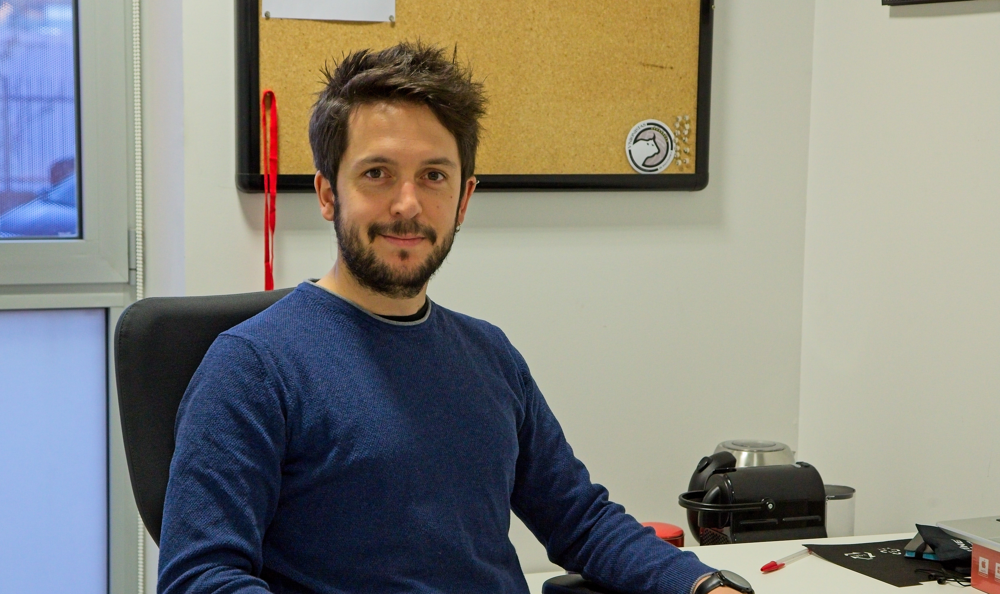



# THE Team

 

### Narciso M. Quijada 
`Principal Investigator`

Narciso is BSc in Pharmacy (Univ. Salamanca, USAL), MSc in Microbiology (Autonomous Univ. of Madrid) and Advances in Food Science and technology (2019, Univ. Burgos, UBU). After gaining his PhD he moved to Vienna (Austria) to perform 3 years of postdoc at Univ. Wien, Univ. Veterinary Medicine (VetMedUni) and FFoQSI Gmbh. Then, in 2022 he came back to Salamanca with a Marie Skłodowska-Curie Actions that he developed at the Institute of Agribiotechnology Research (CIALE). At the end 2024, he joined to the IBFG to lead the Bioinformatics and Data Sciences Unit. Since 2025 he is a CSIC senior scientist ("*científico titular*") and the group leader of `MicrobAR`.

<ins>Find out more</ins>: [GitHub](https://github.com/nmquijada); [ORCID](https://orcid.org/0000-0002-1956-7205); [Scopus](https://www.scopus.com/authid/detail.uri?authorId=57192909558); [Google Scholar](https://scholar.google.es/citations?user=ElgNygIAAAAJ&hl=es&oi=ao)

 

 
 
# Current Lab members

 

### Raquel Barbero
`Visiting Researcher`  

Raquel is doing her PhD at IRYCIS (Spain) and will perform a research stay with us from October 2025 to February 2026.

 

## Co-supervised PhD students

 

### Alejandro J. Alcañiz  
`PhD student`

Alejandro is doing his PhD in Agrobiotechnology at Univ. Salamanca and currently working in the Institute of Agrochemistry and Food Technology-National Research Council (IATA-CSIC, Paterna, Valencia, Spain).  
<ins>PhD supervisors</ins>: Enrique Monte (CIALE), Narciso M. Quijada (IBFG), Javier Sánchez-Martín (CIALE)

 

### David Mendoza-Salido (CIALE, University of Salamanca, Spain)
`PhD student`

David is doing his PhD in Agrobiotechnology at Univ. Salamanca and currently working at the Institute of Agribiotechnology Research (CIALE)  
<ins>PhD supervisors</ins>: Rosa Hermosa (CIALE), Narciso M. Quijada (IBFG)

 

### Moritz Harmann (University of Veterinary Medicine, Vienna, Austria)

`PhD student`  

Moritz Hartmann completed his Bachelor’s degree in Food Science and Biotechnology and his Master’s degree in Food Science and Technology at the University of Natural Resources and Life Sciences (BOKU) in Vienna. His Master’s thesis focused on the effects of wine production and novel fining agents on the residual concentrations of specific fungicides in red wine grapes. After graduating, he became a founding member of the quality management team at Gurkerl.at. Currently, he is pursuing his PhD in the [Selberherr Lab](https://www.vetmeduni.ac.at/en/food-microbiology/about-us/team-evelyne-selberherr), where his research explores the impact of in-house cheese ripening cultures on the safety and quality of long-ripened hard cheeses.  
<ins>PhD supervisors</ins>: Evelyne Selberherr (VetMedUni), Narciso M. Quijada (IBFG) 

  

### Tea Movsesijan (University of Veterinary Medicine, Vienna, Austria)
`PhD student`

 

## Former members

Name | Position | Home institution | Period |
:--: | :------: | :--------------: | :----: |
Franz Ferdinand Roch | PhD student | VetMedUni (Vienna, Austria) | 2021-2025
Guillermo Illán Ortega | visiting PhD student | CEBAS-CSIC (Murcia, Spain) | May-June 2025

 

